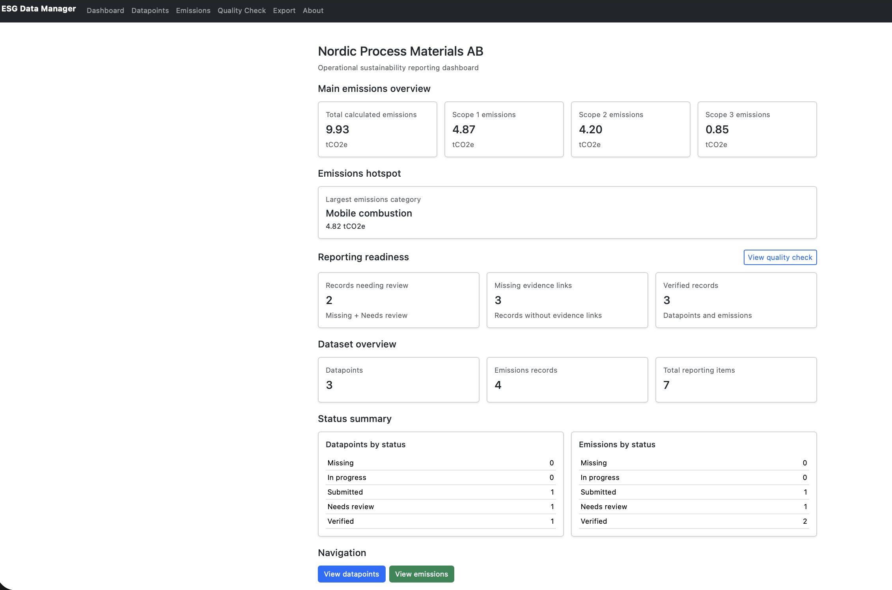
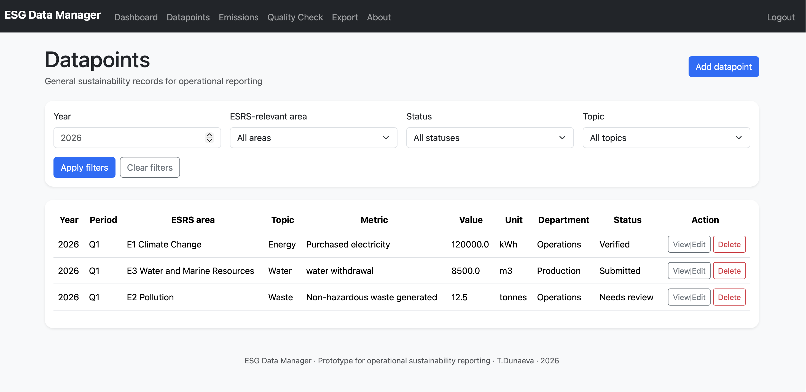
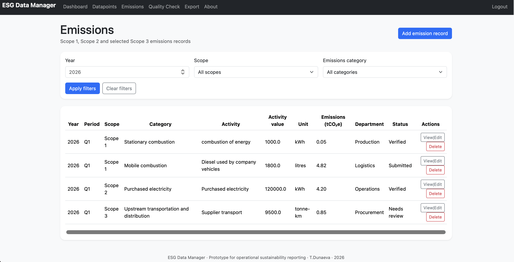
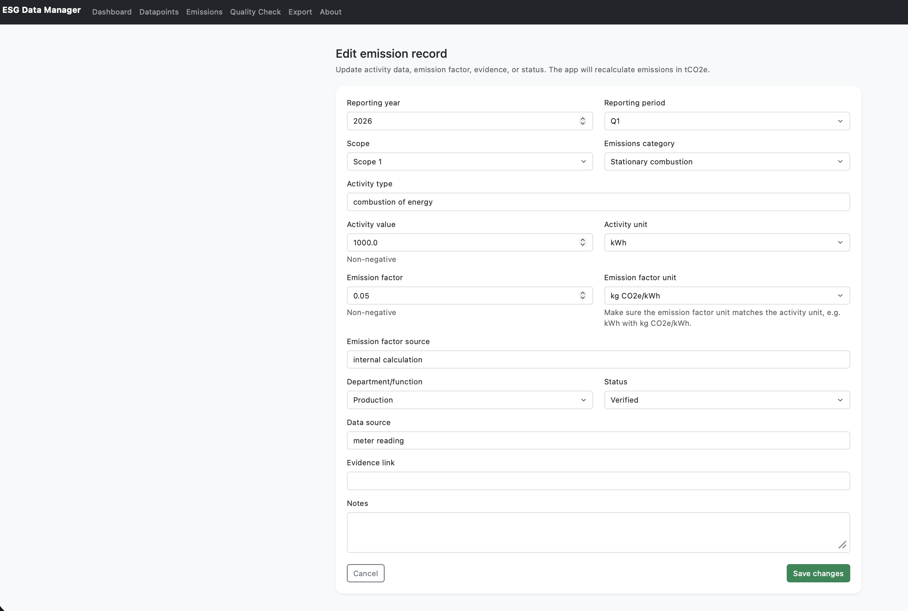
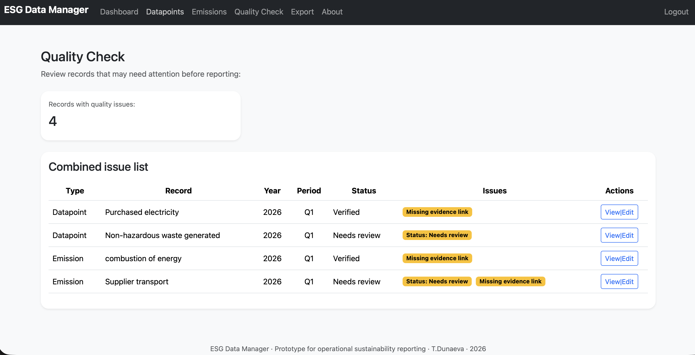
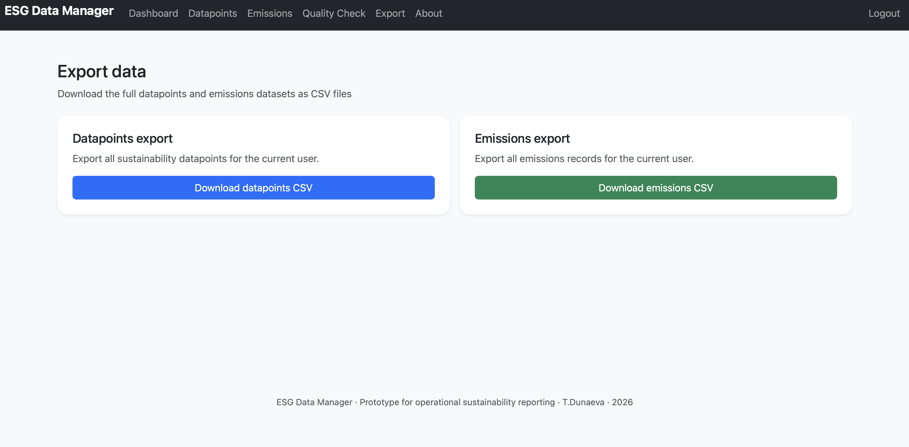
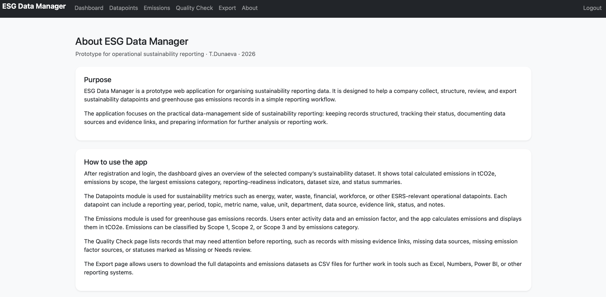

# ESG Data Manager: A Prototype for Operational Sustainability Reporting
ESG Data Manager is a Flask-based prototype for operational sustainability reporting. It supports structured collection, review, calculation, and export of sustainability datapoints and greenhouse gas emissions records.
The project demonstrates how operational sustainability data can be organised before reporting: collecting datapoints, documenting data sources and evidence references, calculating emissions, checking reporting readiness, and exporting structured datasets for further analysis.

## Overview
The application is built around the idea that sustainability reporting is not only about final disclosure text, but also about the structured data work behind the report. Companies need to collect data from different departments, classify it, document data sources, keep evidence references, check reporting status, calculate emissions, and export information for further analysis.
ESG Data Manager is a simplified prototype of such a workflow. It is designed for a fictional company environment and demonstrates how operational sustainability data can be managed in a small web application.

## Main features
The app includes user registration, login, and logout. During registration, the user also enters a company name, which is then displayed on the dashboard. Each user has their own datapoints and emissions records, connected to their user ID in the database.
The main features are:

* Company-specific dashboard after login
* Sustainability datapoints module
* Greenhouse gas emissions module
* Automatic emissions calculation from activity data and emission factors
* Filtering of datapoints and emissions records
* View/Edit and delete workflows for records
* Confirmation page before destructive delete actions
* Combined Quality Check page for reporting-readiness issues
* CSV export for datapoints and emissions
* Public About page explaining the prototype and its limitations

## Screenshots
### Dashboard

### Datapoints

### Emissions

### Add or edit emission

### Quality Check

### Export

### About

## Dashboard
The dashboard is the main entry point after login. It displays the company name and an operational sustainability reporting overview.
It starts with total calculated greenhouse gas emissions in tCO2e, followed by emissions by Scope 1, Scope 2, and Scope 3. It also identifies the largest emissions category, shows reporting-readiness indicators, gives a dataset overview, and summarises datapoints and emissions by status.
The reporting-readiness section links to the Quality Check page, where the user can investigate records that need attention.

## Navigation and Workflow
The application includes a navigation bar that gives access to the main sections of the app. In addition to the navigation bar, pages are connected through contextual links and action buttons.
For example, users can move from the dashboard to the Quality Check page, from the Quality Check page directly to records that need editing, and from the datapoints and emissions lists to add, edit, or delete individual records.
This was designed to make the workflow logical and reduce unnecessary steps while reviewing and correcting reporting data.

## Datapoints Module
The Datapoints module allows the user to add, view, filter, edit, and delete sustainability datapoints.
A datapoint can include:

* reporting year
* reporting period
* ESRS-relevant area
* topic
* metric name
* value
* unit
* department
* data source
* evidence link
* status
* notes

Controlled dropdowns are used for many fields to keep the data more structured and consistent. The status workflow includes Missing, In progress, Submitted, Needs review, and Verified.

## Emissions Module
The Emissions module allows the user to add, view, filter, edit, and delete greenhouse gas emissions records. 
The user enters activity data and an emission factor, and the application calculates emissions as:
    activity value × emission factor = calculated emissions
Internally, calculated emissions are stored in kilograms of CO2e, while the user interface displays them in tonnes of CO2e.
Emissions can be classified by scope and emissions category. The app includes selected categories across Scope 1, Scope 2, and Scope 3, such as stationary combustion, mobile combustion, purchased electricity, purchased goods and services, waste generated in operations, and end-of-life treatment of sold products.
Emission factors are entered manually by the user, and the app includes a field for emission factor source.

## Quality Check
The Quality Check page is a combined issue list for datapoints and emissions records.
Instead of showing separate tables for each type of issue, it creates one row per record and groups all issues for that record together. The page checks for:

* records with status Missing
* records with status Needs review
* missing evidence links
* missing data sources
* missing emission factor sources for emissions records

Each issue row includes a View/Edit link, so the user can go directly to the relevant record and correct it.
This page represents the reporting-readiness logic of the prototype. The dashboard shows aggregated warning signals, while the Quality Check page explains which records require attention.

## CSV Export
The Export page allows the user to download all datapoints and all emissions records as CSV files.
The exported CSV files can be opened in Excel, Numbers, Power BI, or other reporting and analysis tools. For emissions, the export includes both calculated emissions in kilograms of CO2e and calculated emissions in tonnes of CO2e.

## How to View or Run the Project
This repository contains the source code and documentation for ESG Data Manager. The project is currently shared as a GitHub portfolio repository, not as a permanently deployed live web application.
Visitors can view the project directly on GitHub by reading this README, looking at the screenshots, and browsing the source code.
To run the application locally, clone or download this repository and open the project folder in a development environment with Python installed.
Install the required packages:
* pip install -r requirements.txt
Create the SQLite database from the schema:
* sqlite3 esg.db < schema.sql
Run the Flask application:
* flask run
Then open the local development URL shown in the terminal. After opening the app, a new user can register a company account and start adding datapoints and emissions records.
At this stage, the project uses the CS50 Python library for database access, so the cs50 package is included in requirements.txt.

## Project Structure
The project files are organised as a typical Flask application.
app.py contains the main Flask routes, database queries, validation logic, emissions calculations, dashboard calculations, quality checks, and CSV export routes.
helpers.py contains reusable helper functions, including login_required for protecting routes and apology for displaying user-friendly error messages.
schema.sql defines the SQLite database structure, including the users, datapoints, and emissions tables.
requirements.txt lists the Python packages needed for the project.
The templates folder contains the HTML templates:

* layout.html defines the shared page structure, navigation bar, Bootstrap links, and footer.
* index.html displays the dashboard.
* about.html explains the purpose, use, features, limitations, and possible future development of the prototype.
* register.html and login.html handle authentication pages.
* datapoints.html, add_datapoint.html, edit_datapoint.html, and delete_datapoint.html support the datapoints workflow.
* emissions.html, add_emission.html, edit_emission.html, and delete_emission.html support the emissions workflow.
* quality.html displays the combined quality issue list.
* export.html provides CSV download options.
* apology.html displays controlled error messages.

The static folder contains styles.css, which adds small visual styling improvements.

## Technology Stack 
The project is implemented mainly in Python using the Flask framework. It uses:

* Python for application logic, validation, emissions calculations, quality checks, and CSV export
* Flask for routing and web application structure
* SQLite as the database
* SQL for database queries
* HTML with Jinja templating for dynamic web pages
* Bootstrap for layout and styling
* CSS for additional visual adjustments
* Python’s built-in CSV tools for data export

## Design Choice
Several design choices were important in this project.
I chose to keep datapoints and emissions as separate modules because emissions records require specific fields such as scope, activity data, emission factor, emission factor unit, and calculated emissions. At the same time, both modules share common reporting concepts such as reporting year, status, evidence link, data source, department, and notes. This separation keeps the data model clearer.
I also chose to use a confirmation page before deleting records. Deleting is a destructive action, so the app first shows the selected record and asks the user to confirm. The actual deletion happens only after a POST request from the confirmation page. This makes the application safer and follows a more responsible web-app design pattern.
Another design choice was to keep emission factor entry manual. Automatic factor libraries or external APIs would make the application more complex and would require careful handling of factor sources, geography, year, units, and methodology. For this prototype, manual entry keeps the logic transparent while still demonstrating the core calculation workflow.
The Quality Check page was designed as a combined issue list rather than separate tables. This makes it easier for the user to see all records that require attention in one place, while still linking directly to the correct edit page.

## Limitations
The application is not intended to be a complete CSRD compliance system, certified carbon accounting platform, or external assurance tool. It supports structured data collection and review, but it does not determine whether a company fully complies with legal reporting requirements.
The app does not currently include:

* user roles or reviewer permissions
* audit trails
* approval workflows
* file uploads
* automatic emission factor databases
* supplier-specific factor libraries
* external API connections
* complete Scope 3 value-chain modelling
* advanced validation of unit compatibility
* deployment-ready production configuration

The current version is a portfolio prototype showing how operational sustainability data can be structured, checked, summarised, and exported in a reporting workflow.

## Future Development
Possible future improvements include:

* CSV import
* chart visualisations
* year-on-year trend analysis
* emission factor libraries
* user roles and review permissions
* audit trail showing who changed records and when
* more advanced Scope 3 categories
* supplier-data workflows
* integration with Power BI or other reporting tools
* replacement of course-specific libraries with standard production-oriented libraries
* deployment as a live demo application

## Project Origin
This project originated as a CS50 final project and was later adapted as a portfolio prototype for sustainability data management and operational reporting workflows.

## Acknowledgements
During the development of this project, I used ChatGPT as a learning and coding assistant. The tool helped me discuss project structure, understand Flask and Python syntax, design the dashboard and quality-check workflow, debug errors, and draft or revise parts of the code and documentation.
I reviewed, tested, modified, and adapted the implementation throughout the development process.
